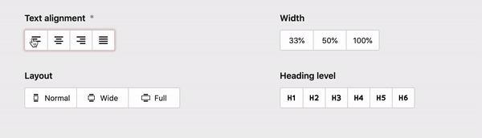

# Multi-Toggle field for Kirby 3

An exploration of a new UI element/field for Kirby CMS, resembling the multi-toggles ususally found in desktop software for things, such as text alignment and various other settings.

Unlike most Kirby fields, the multi-toggle does not cover the whole available width, to give it a lighter appearance. But it has a min-height set, so it won’t look weird, when placed next to another field in a multi-column layout.



## Blueprint usage

```yaml

# Icons and text labels
textAlign:
  type: multi-toggle
  label: Text alignment
  textLabels: true
  required: true # reset button is automatically disabled, when field is required
  options:
    - value: normal
      text: Left
      icon: align-left
    - value: center
      text: Center
      icon: align-center
    - value: right
      text: Right
      icon: align-right
    - value: justify
      text: Justify
      icon: align-justify

# Text labels only
width:
  type: multi-toggle
  label: Width
  textLabels: true
  reset: false # reset button can also be disabled for non-required fields.
  options:
    third: 33%
    half: 50%
    full: 100%

#  Icons only
level:
  type: multi-toggle
  label: Heading level
  textLabels: false
  width: 1/2
  options:
    - value: h1
      text: h1
      icon: heading-1
    - value: h2
      text: h2
      icon: heading-2
    - value: h3
      text: h3
      icon: heading-3
    - value: h4
      text: h4
      icon: heading-4
    - value: h5
      text: h5
      icon: heading-5
    - value: h6
      text: h6
      icon: heading-6
```

## System Requirements

- Kirby 3.3+
- PHP 7.3+

## License

This plugin is licensed under the MIT license with the exception of the included icons from the Nucleo set. See src/index.js for further information on the icons’ license.